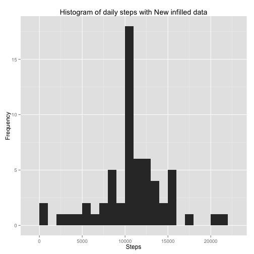

## Loading and preprocessing the data

The following code will set the working directory and load the data into a dataframe called activityData. The dataframe is then converted to a dplyr dataframe as that would make grouping the data easier for the next questions. When loading the data, only the collumn classes are changed as the Date is loaded as a factor by default and not a date. The NA values are kept as placeholder as they will be supstitituted in a later section.


```r
library(dplyr) #Load the dplyr library
setwd("~/Documents/Coursera/Specialization/05 Reproducable Research/Assignment/Assignment 1/RepData_PeerAssessment1") #Set the working directory to the location of the file
activityData<-read.csv("activity.csv",colClasses = c("integer","Date","integer")) #Load the data
activityData<-tbl_df(activityData) #Convert the data to a dplyr tbl class
str(activityData) #Display the data
```

```
## Classes 'tbl_df', 'tbl' and 'data.frame':	17568 obs. of  3 variables:
##  $ steps   : int  NA NA NA NA NA NA NA NA NA NA ...
##  $ date    : Date, format: "2012-10-01" "2012-10-01" ...
##  $ interval: int  0 5 10 15 20 25 30 35 40 45 ...
```

## What is mean total number of steps taken per day?

###Daily sum of steps

The dplyr group_by,filter and summarise functions are used to calculate the daily steps.


```r
dailySum<- activityData %>% group_by(date) %>%filter(!is.na(steps))%>%summarise(dailysum=sum(steps))
dailySum #print the daily steps
```

```
## Source: local data frame [53 x 2]
## 
##          date dailysum
## 1  2012-10-02      126
## 2  2012-10-03    11352
## 3  2012-10-04    12116
## 4  2012-10-05    13294
## 5  2012-10-06    15420
## 6  2012-10-07    11015
## 7  2012-10-09    12811
## 8  2012-10-10     9900
## 9  2012-10-11    10304
## 10 2012-10-12    17382
## ..        ...      ...
```

### Histogram of the daily steps


```r
library(ggplot2) #Load the ggplot2 library
qplot(dailySum$dailysum,geom='histogram',binwidth=1000,main = "Histogram of daily steps", xlab = "Steps", ylab ="Frequency")
```

 

### The mean and median of the total number of steps taken per day

The mean of the total number of daily steps are calculated as follows:

```r
meanDailySteps<-mean(dailySum$dailysum)
meanDailySteps
```

```
## [1] 10766.19
```

The median of the total number of daily steps are calculated as follows:

```r
medianDailySteps<-median(dailySum$dailysum)
medianDailySteps
```

```
## [1] 10765
```

## What is the average daily activity pattern?

The average of the daily activity pattern is calculated using Dplyr group_by and summarise functions again:

```r
averageDaily<- activityData %>% group_by(interval) %>% filter(!is.na(steps)) %>% summarise(meanSteps=mean(steps))
qplot(averageDaily$interval,averageDaily$meanSteps,geom="line",main = "Average steps over the 5-minute intervals averaged over all days", xlab = "5-minute interval", ylab ="Average steps")
```

 

Finding the maximum value and the interval is done below:

```r
maxSteps<-max(averageDaily$meanSteps)
maxStepsIndex<-which.max(averageDaily$meanSteps) #Calculates the index in averageDaily for this location of Max steps
maxInterval<-averageDaily[maxStepsIndex,1]
```
The maximum average steps are 206.1698113 and the interval where this happens is at the 835'th 5-minute interval.

## Imputing missing values

### 1. Total number of missing values in the dataset

The total number of missing values are calculated and given below usind the dplyr filter function:

```r
missingEntries<-dim(activityData%>%filter(is.na(steps)))[1]
missingEntries
```

```
## [1] 2304
```

### 2. Filling in some data strategy

The average daily activity is used to fill in the missing data as was calculated above. The missing data interval is taken and the corresponding data from "averageDaily" is used to fill in the data for that specific interval.

### 3. Filling in the data: code and sample of the result


```r
aDataNew<-activityData      
for(i in 1:dim(aDataNew)[1]) {
       if(is.na(aDataNew$steps[i])){
            aDataNew$steps[i]<- (averageDaily %>% filter(interval==aDataNew$interval[i]))$meanSteps
       }
}
head(aDataNew)
```

```
## Source: local data frame [6 x 3]
## 
##       steps       date interval
## 1 1.7169811 2012-10-01        0
## 2 0.3396226 2012-10-01        5
## 3 0.1320755 2012-10-01       10
## 4 0.1509434 2012-10-01       15
## 5 0.0754717 2012-10-01       20
## 6 2.0943396 2012-10-01       25
```

### 4. Histogram of the newly filled data


```r
dailySumNew<- aDataNew %>% group_by(date) %>%summarise(dailysum=sum(steps))
dailySumNew #print the New daily steps for comparison with the first section
```

```
## Source: local data frame [61 x 2]
## 
##          date dailysum
## 1  2012-10-01 10766.19
## 2  2012-10-02   126.00
## 3  2012-10-03 11352.00
## 4  2012-10-04 12116.00
## 5  2012-10-05 13294.00
## 6  2012-10-06 15420.00
## 7  2012-10-07 11015.00
## 8  2012-10-08 10766.19
## 9  2012-10-09 12811.00
## 10 2012-10-10  9900.00
## ..        ...      ...
```

```r
qplot(dailySumNew$dailysum,geom='histogram',binwidth=1000,main = "Histogram of daily steps with New infilled data", xlab = "Steps", ylab ="Frequency")
```

 

The mean and median of this new infilled data is calculated as follows:

```r
meanNewDailySumData<-mean(dailySumNew$dailysum)
medianNewDailySumData<-median(dailySumNew$dailysum)
```

The mean of the new infilled dataset is 1.0766189 &times; 10<sup>4</sup> and the median is 1.0766189 &times; 10<sup>4</sup>. Comparing this with the non filled data (mean=1.0766189 &times; 10<sup>4</sup>; median=10765) we see the means are the same but the median differs slightly. As a further proof, calculating the difference in mean and median for the infilled and non-infilled data we get the following result:


```r
meanDiff<-meanNewDailySumData-meanDailySteps
medianDiff<-medianNewDailySumData-medianDailySteps
meanDiff
```

```
## [1] 0
```

```r
medianDiff
```

```
## [1] 1.188679
```

## Are there differences in activity patterns between weekdays and weekends?

The weekdays() function is used to determine the day of the week and this is added to the dayType column


```r
for(i in 1:dim(aDataNew)[1]) {
        dayoftheweek<-weekdays(aDataNew$date[i])
       if(dayoftheweek=="Saturday" || dayoftheweek=="Sunday"){
                aDataNew$dayType[i]<-"Weekend"
       } else aDataNew$dayType[i]<-"Weekday"
}
```

Next we will use dplyr to group_by and then calculate the average by 5-minute interval using the summarise function:

```r
aDataNewMean<-aDataNew %>% group_by(dayType,interval)%>%summarise(meanSteps=mean(steps))
aDataNewMean$dayType<-as.factor(aDataNewMean$dayType) #change the daytype to a factor for the plot
str(aDataNewMean) #Display the data
```

```
## Classes 'grouped_df', 'tbl_df', 'tbl' and 'data.frame':	576 obs. of  3 variables:
##  $ dayType  : Factor w/ 2 levels "Weekday","Weekend": 1 1 1 1 1 1 1 1 1 1 ...
##  $ interval : int  0 5 10 15 20 25 30 35 40 45 ...
##  $ meanSteps: num  2.251 0.445 0.173 0.198 0.099 ...
##  - attr(*, "vars")=List of 1
##   ..$ : symbol dayType
##  - attr(*, "drop")= logi TRUE
```

ggplot will be used to plot the difference between the weekend and weekdays.

```r
p<-ggplot(aDataNewMean,aes(interval,meanSteps))+ facet_grid(dayType~.)
p<-p+geom_line() + ylab("Average steps")+xlab("5-min intervals")+ggtitle("Comparison of average steps taken over weekends and weekdays")
print(p)
```

 
